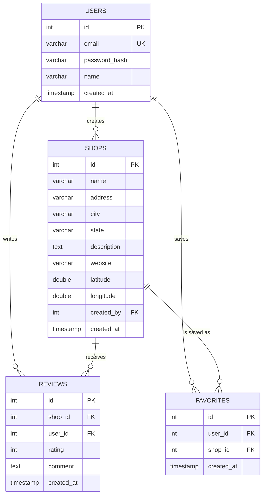

# Entity Relationship Diagram

## Relationships
- One `user` can create many `shops` (`shops.created_by → users.id`).
- One `shop` can have many `reviews`; one `user` can write many `reviews` (`reviews.shop_id → shops.id`, `reviews.user_id → users.id`).
- `favorites` is a join table connecting `users` and `shops` in a many-to-many relationship, with a unique constraint on `(user_id, shop_id)` so a shop can only be favorited once per user.
